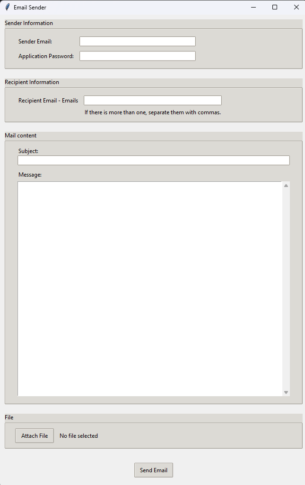
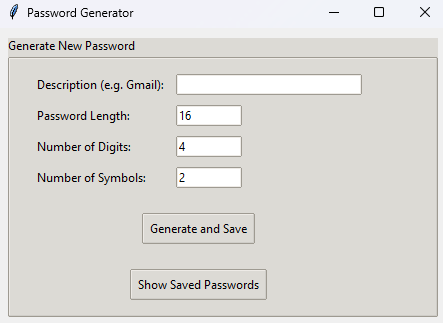
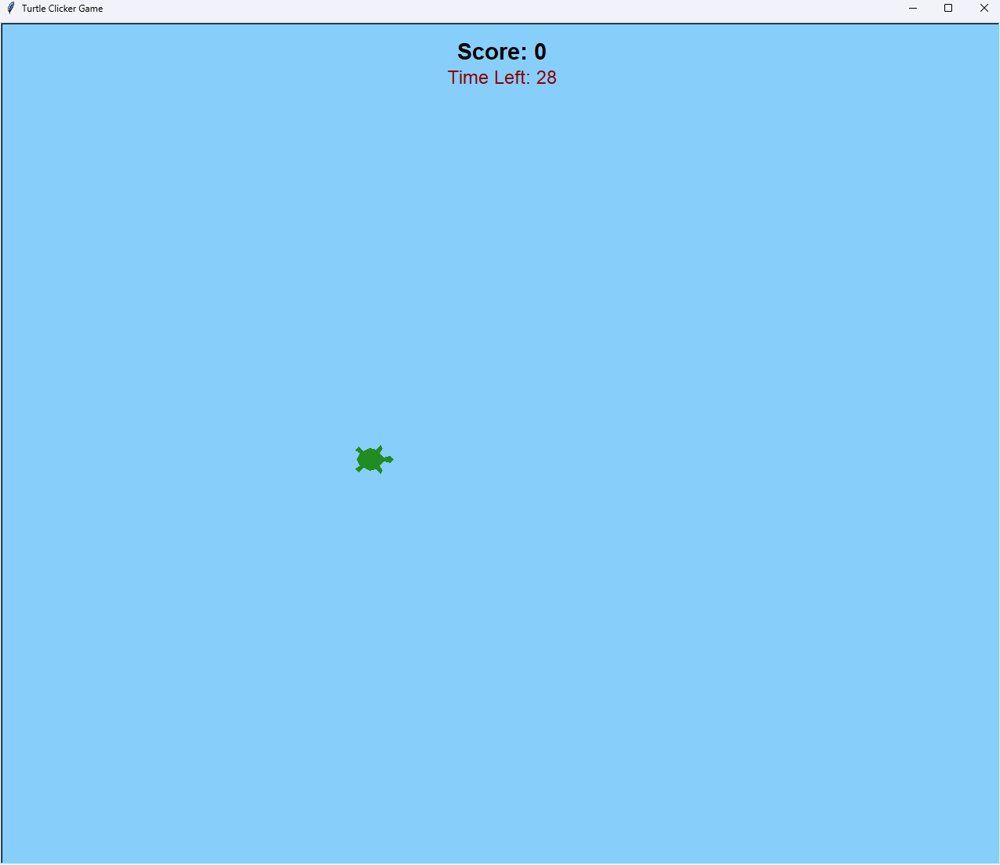

📁 Personal Python Toolkit
A beginner-friendly collection of desktop GUI utilities, mini-games and web scraping demos that I built while learning Python.
Perfect for portfolio, code-review or just daily use.

🌟 Portfolio Fit
| What recruiters / instructors like | Where it shows up in the repo                                                               |
| ---------------------------------- | ------------------------------------------------------------------------------------------- |
| **Variety of domains**             | GUI apps, web-scraping, crypto, games, automation                                           |
| **Clean & commented code**         | Every file has docstrings and inline comments                                               |
| **Real-world libraries**           | `tkinter`, `requests`, `cryptography`, `instaloader`, `smtplib`, `turtle`, `beautifulsoup4` |
| **End-to-end mini-projects**       | Each script is runnable out-of-the-box with a simple `pip install`                          |

🧰 10 Mini-Projects at a Glance
| #  | File                      | Purpose                             | Highlights                                |
| -- | ------------------------- | ----------------------------------- | ----------------------------------------- |
| 1  | `bmi.py`                  | BMI Calculator (Tkinter)            | Input validation, health categories       |
| 2  | `generate_password.py`    | Encrypted password manager          | `cryptography.fernet`, on-disk encryption |
| 3  | `google_copy.html`        | Dark-theme Google clone             | Pure CSS, responsive, no JS               |
| 4  | `instagram_downloader.py` | Insta post downloader               | `instaloader`, threading, progress UX     |
| 5  | `alarm_app.py`            | Pomodoro-style timer                | `playsound`, CLI simplicity               |
| 6  | `Mail_send_app.py`        | Bulk e-mail sender with attachments | Gmail SMTP, MIME, file dialog             |
| 7  | `openweather_app.py`      | Weather widget                      | OpenWeatherMap API, JSON parse            |
| 8  | `Hackernews_request.py`   | Headlines scraper                   | `requests` + `BeautifulSoup`, CLI output  |
| 9  | `secret_notes.py`         | AES-encrypted note vault            | PBKDF2 key derivation                     |
| 10 | `turtle_game.py`          | 30-second clicker game              | `turtle` graphics, countdown timer        |

🚀 Quick Start
# 1. Clone or download this repo
git clone https://github.com/yourname/python-toolkit.git
cd python-toolkit

# 2. Create a virtual env (optional but recommended)
python -m venv venv
source venv/bin/activate  # Win: venv\Scripts\activate

# 3. Install common dependencies
pip install -r requirements.txt
requirements.txt (sample)
requests
beautifulsoup4
cryptography
instaloader
playsound==1.3.0
Pillow

📸 Screenshots & Demos
| App                | Screenshot                                  |
| ------------------ | ------------------------------------------- |
| Email Sender       |       |
| Password Generator |       |
| Turtle Game       |     |

🧪 How to Run Each Script
| Script        | Run                                    |
| ------------- | -------------------------------------- |
| GUI Apps      | `python bmi.py`                        |
| CLI / Scraper | `python Hackernews_request.py`         |
| Web Demo      | Open `google_copy.html` in any browser |

---

## 🛠️ Tech Stack

- **Languages** Python 3.9+, HTML5  
- **GUI** tkinter, ttk, turtle  
- **Networking** requests, smtplib, instaloader  
- **Crypto** cryptography (Fernet, PBKDF2)  
- **Multimedia** playsound
- 
---

## 🤝 Contributing  
Found a bug or want a new feature?  
1. Open an issue describing the idea.  
2. Fork the repo, create a branch, and submit a pull request.  
All contributions—code, docs, translations—are welcome!

## 📄 License  
MIT © 2024 Mustafa – free to use in homework, interviews or hackathons.
